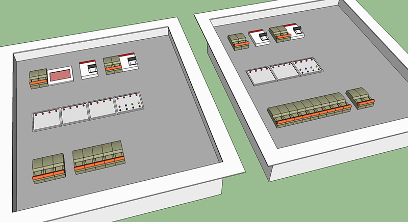
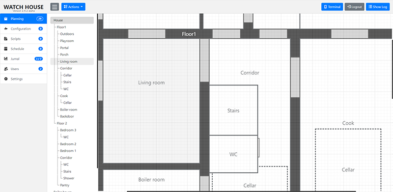
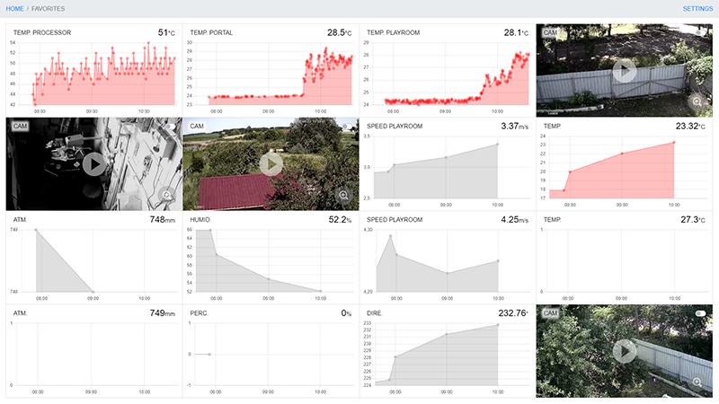

# WATCH HOUSE

<p>




Watch House is a powerful system for home automation that includes a 
flexible architecture that allows you to connect to it even devices 
not intended for this purpose. It is absolutely free and is developed 
exclusively under the [MIT license](https://opensource.org/licenses/MIT).

The basis of the system can be a low-power microcomputer such as 
RaspberryPi or OrangePi, and a flexible and at the same time powerful 
administration system will allow you to quickly configure the necessary 
configuration of the system.

The system does not use any cloud technologies, however, with 
appropriate settings, it can use third-party services such as weather 
forecast services.

The architecture of the system is designed in such a way as to 
distribute the execution of scripts among the responsible devices. 
Thus, to perform most of the actions, the server may not take any 
part other than transferring the processed data.

Together with the software, the repository contains the necessary 
materials for the reproduction of some exclusive devices, such as a 
touch switch or a Din controller.

The system includes support for devices whose configuration is 
fundamentally different, so the system includes the necessary tools 
for translating scripts into different languages for different 
platforms. At the moment, there are the following translators:
- Python. For PyHome System (pyboard v1.0)
- C. For avr microcontrollers (atmega16, atmega328)
- Php. For execute server commands (RaspberryPi, OrangePi etc.).

For simple control or management of devices, a web page with an 
adaptive design is used, which is equally convenient to use on any 
device.

## Short installation guide

An example of installing the system on OrangePi Light with the Armbian operating system.
- Armbian 22.02.1 Jammy with bleeding edge Linux 5.16.11-sunxi
- php 8.1
- mysql 8.0

```
sudo apt update
sudo apt install apache2
sudo apt install php libapache2-mod-php
sudo apt install libzip-dev php-zip
cd /var/www
sudo rm -r html
sudo chgrp www-data .
sudo chmod 775 .
sudo -u www-data git clone https://github.com/SolitonNew/wh.git .
sudo nano /etc/apache2/apache2.conf
```
```
<Directory /var/www/server>
	AllowOverride All
	Require all granted
</Directory>
```
```
sudo nano /etc/apache2/sites-available/000-default.conf
```
```
DocumentRoot /var/www/server/public
```
```
sudo a2enmod rewrite
sudo systemctl restart apache2
```
```
sudo apt install mysql-server
sudo apt install php8.1-mysql
sudo nano /etc/mysql/mysql.conf.d/mysqld.cnf
```
```
skip-log-bin
innodb_buffer_pool_size = 24M
performance_schema = OFF
```
```
sudo mysql
```
```
CREATE USER 'watchhouse'@'localhost' IDENTIFIED BY 'watchhousepass';
CREATE DATABASE watchhouse;
GRANT ALL PRIVILEGES ON watchhouse.* TO 'watchhouse'@'localhost';
FLUSH PRIVILEGES;
exit
```
```
sudo apt install php-xml
sudo apt install composer
cd server
sudo -u www-data composer install
sudo -u www-data cp .env.example .env
sudo -u www-data nano .env
```
```
APP_KEY=
DB_DATABASE=watchhouse
DB_USERNAME=watchhouse
DB_PASSWORD=watchhousepass
```
```
sudo -u www-data php artisan migrate --force --seed
```
```
sudo adduser www-data dialout
sudo nano /etc/cron.d/wh
```
```
* * * * *   www-data   /usr/bin/php /var/www/server/artisan schedule:run >/dev/null 2>&1
```
```
sudo apt-get install avr-libc gcc-avr
```
```
sudo apt-get install libgpiod-dev gpiod
sudo addgroup gpio
sudo adduser www-data gpio
sudo adduser www-data i2c
sudo nano /etc/udev/rules.d/20-gpio.rules
```
```
KERNEL=="gpio*", GROUP="gpio"
SUBSYSTEM=="i2c-dev", GROUP="i2c"
```
```
sudo apt install ffmpeg
```
Default credentials
- Admin Login/Password: wh/wh
- Terminal Login/Password: terminal/terminal

## License

The WatchHouse system is open-source software licensed under the [MIT license](https://opensource.org/licenses/MIT).
