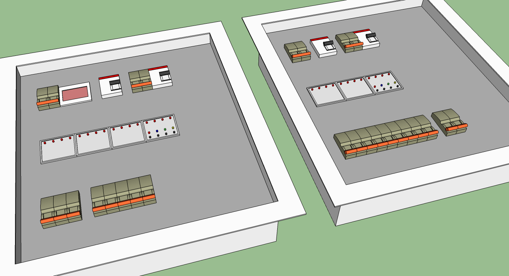
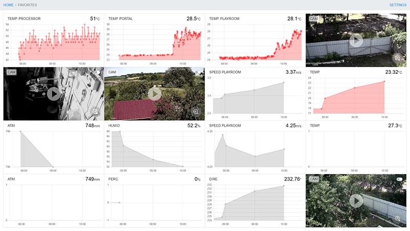

# WATCH HOUSE
<p>



</p>

## Short installation guide

An example of installing the system on OrangePi Light with the Armbian operating system.

```
sudo apt update
sudo apt install apache2
sudo apt install php libapache2-mod-php
cd /var/www
sudo rm -r html
sudo chgrp www-data .
sudo chmod 775 .
sudo -u www-data git clone https://github.com/SolitonNew/wh.git .
sudo nano /etc/apache2/apache2.conf
```
```
<Directory /var/www/server>
	AllowOverride All
	Require all granted
</Directory>
```
```
sudo nano /etc/apache2/sites-available/000-default.conf
```
```
DocumentRoot /var/www/server/public
```
```
sudo a2enmod rewrite
sudo systemctl restart apache2
```
```
sudo apt install mysql-server
sudo apt install php8.1-mysql
sudo nano /etc/mysql/mysql.conf.d/mysqld.cnf
```
```
skip-log-bin
```
```
sudo mysql
```
```
CREATE USER 'watchhouse'@'localhost' IDENTIFIED BY 'watchhousepass';
CREATE DATABASE watchhouse;
GRANT ALL PRIVILEGES ON watchhouse.* TO 'watchhouse'@'localhost';
FLUSH PRIVILEGES;
exit
```
```
sudo apt install php-xml
sudo apt install composer
cd server
sudo -u www-data composer install
sudo -u www-data cp .env.example .env
sudo -u www-data nano .env
```
```
APP_KEY=
DB_DATABASE=watchhouse
DB_USERNAME=watchhouse
DB_PASSWORD=watchhousepass
```
```
sudo -u www-data php artisan migrate --force --seed
```
```
sudo adduser www-data dialout
sudo nano /etc/cron.d/wh
```
```
* * * * *   www-data   /usr/bin/php /var/www/server/artisan schedule:run >/dev/null 2>&1
```
```
sudo apt-get install avr-libc gcc-avr
```
```
sudo apt-get install libgpiod-dev gpiod
sudo addgroup gpio
sudo adduser www-data gpio
sudo adduser www-data i2c
sudo nano /etc/udev/rules.d/20-gpio.rules
```
```
KERNEL=="gpio*", GROUP="gpio"
SUBSYSTEM=="i2c-dev", GROUP="i2c"
```
```
sudo apt install ffmpeg
```
```
Admin Login/Password: wh/wh
Terminal Login/Password: terminal/terminal
```
## License

The WatchHouse system is open-source software licensed under the [MIT license](https://opensource.org/licenses/MIT).
